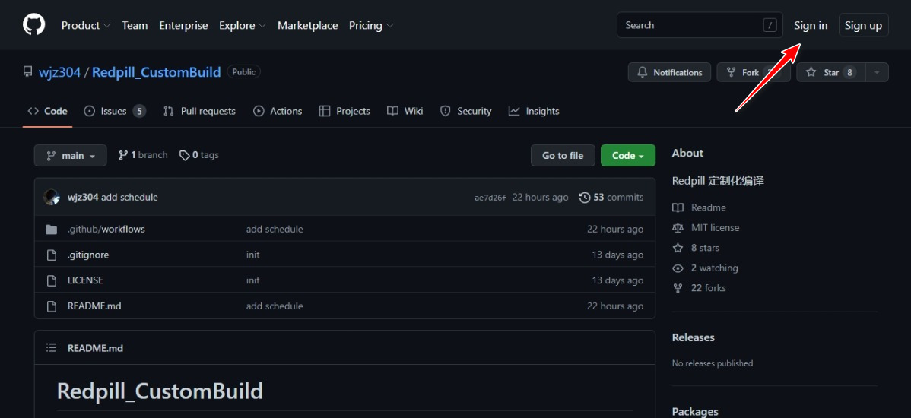
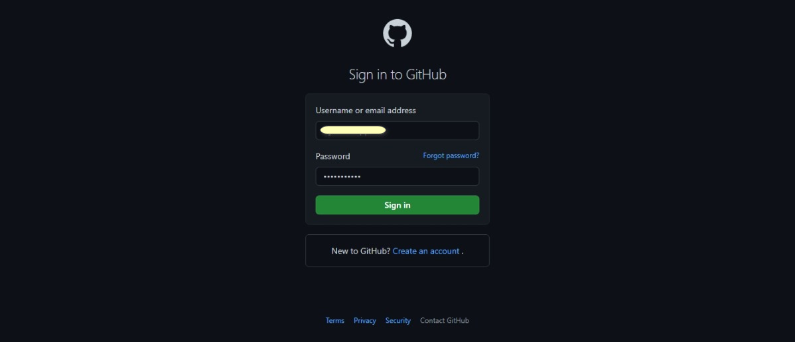
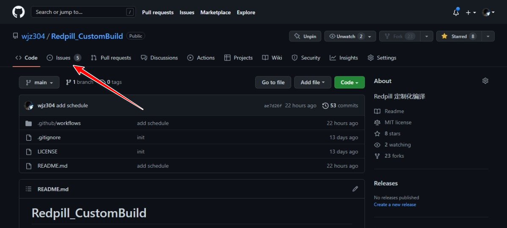
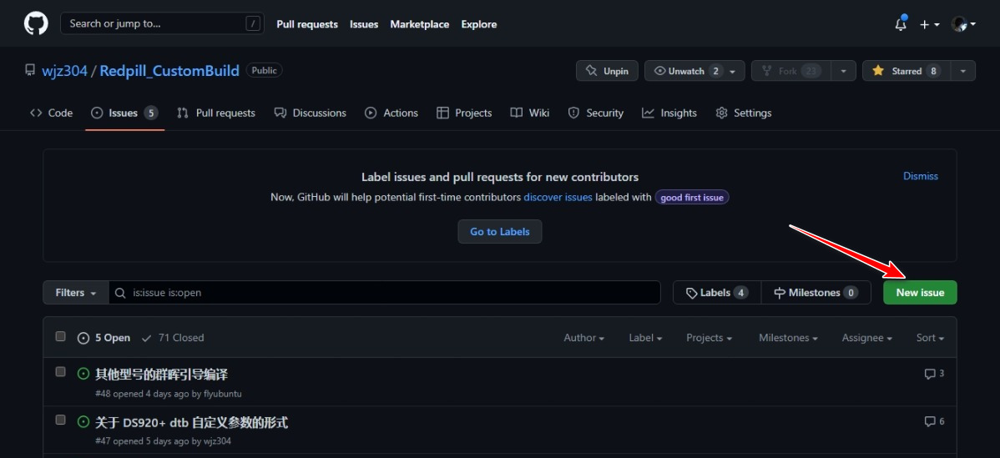
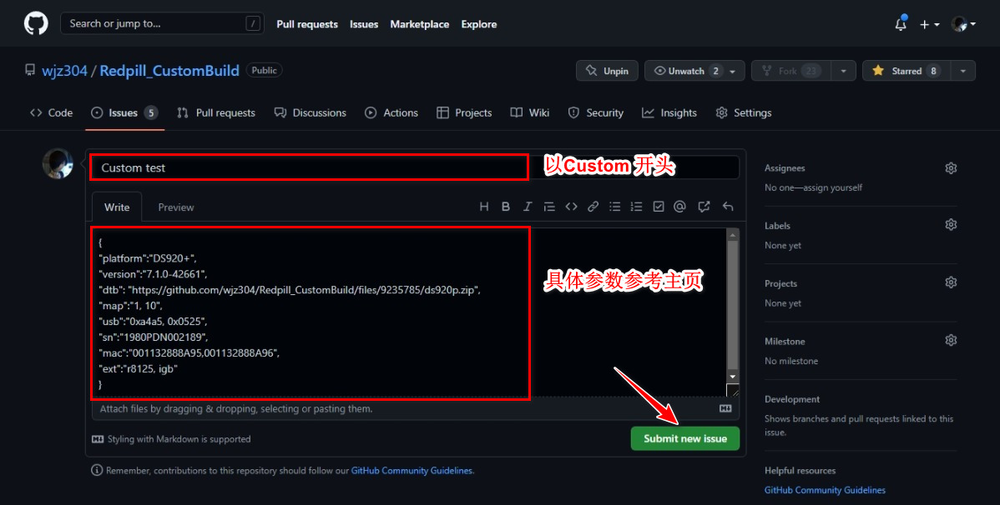
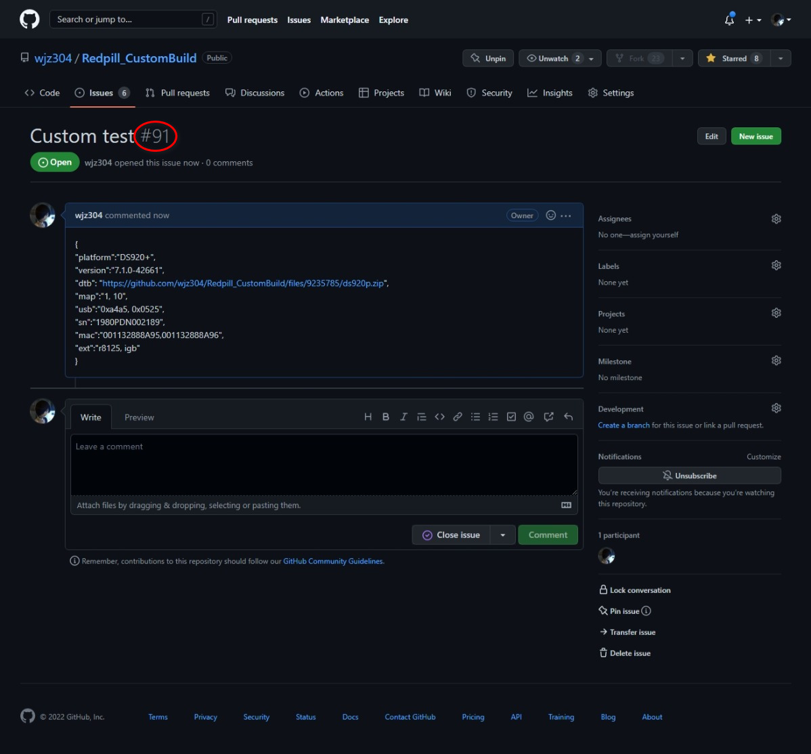
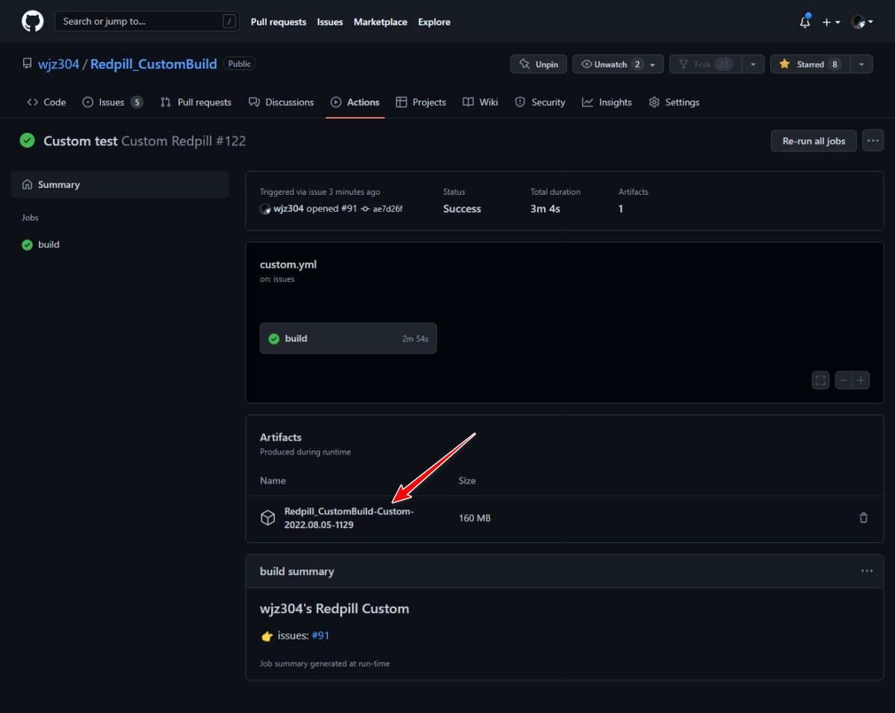
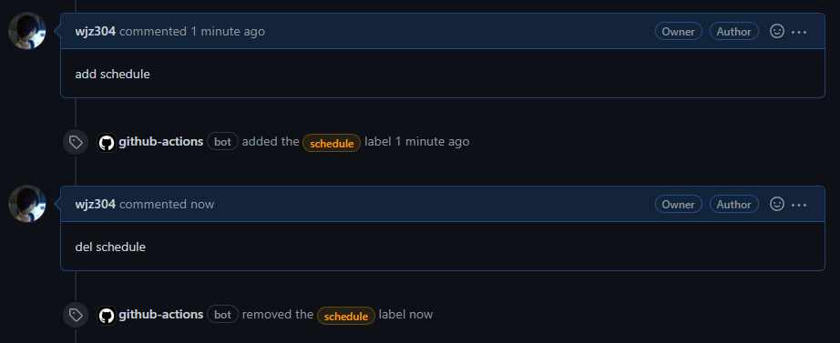

## Issues 编译教程

### 登录 Github
1. 点击右上角的 "Sign in".
 
2. 输入账号密码。
 

### 创建 Issues
1. 点击上方的 "Issues"
 
2. 然后点击 "New Issues"
 
3. 填入相关内容后点击 "Submit new issue"
 
4. 出现如下所示即表示 Issue 创建好了, 等待编译信息即可。
 
5. 出现如下所示时, 即表示构建完成，点击评论中的链接即跳到编译结果页面。
 
### 下载 附件
1. 点击 Artifacts 下方的附件下载即可。
 

## Issues 每日(循环)构建教程

### 添加/删除标签
1. 评论 add schedule 将打上 schedule 标签。  
2. 删除 add schedule 的评论或者增加 del schedule 评论将删除 schedule 标签。  
 `(PS: 获取最后一条含有 schedule 关键字的评论，内容为 "add schedule" 时增加标签，否则删除)`
 

